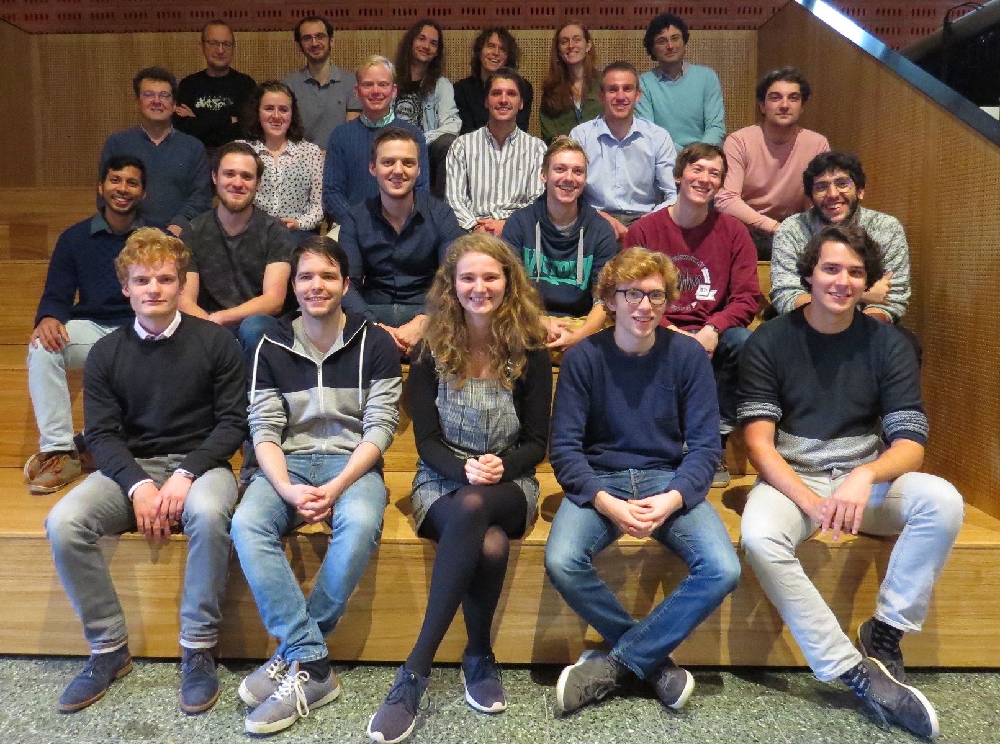

# Welcome!

You find yourself at the front page of the Utrecht Experiment Design course documentation, edition 2020. 

Welcome! :confetti_ball: :heart_eyes: :smile: :confetti_ball:

## From the course coordinator
 
I am thrilled to be your host in the second edition of the Utrecht Experiment Design (UED) course. My name is Sanli and my goal is to make this course the most memorable one in your program.

Part of the course syllabus is similar to other practical courses you have seen in the past. Other parts might seem a bit odd (e.g. community interactions, story-telling, value exchange) at first, but I hope that by the end of the course, they all make sense to you. Remember, the main goal of this course is to empower you (plural) to be a distinguishable cohort of experimental physics students. Making measurement setups that work and reporting on your experience are means to that goal.

Last year, UED was run for the first time. I had to make a good deal of planning only based on intuition. Luckily, students, their mentors and the involved experts at the physics department, told me they had an overall positive experience, and blessed me with well-intentioned constructive feedback. The course ended with a festive poster presentation. We even had cake and everyone seemed to be very pleased. Some of those students will be your mentors this year. 

*Group photo with the "πoneers"*

This year, we are equipped with the experience and feedback of your predecessors and have planned a tighter framework. The major part of the course, however, will be filled in with your participation. 

I hope that this guide can help you navigate through the logistics and instructions of this round. If anything is unclear or if you have questions that are not answered, please reach out to me directly. I am here to help.

#### how to reach me:
+ Email: s.faez@uu.nl 
+ Preferred mode of communciaiton: messaging on team
+ Office: Ornstein laboratory 266
+ Twitter: [@sanli](https://twitter.com/sanli/)

The files in coordination directory contain most of the information about the course. To start, you can check the [syllabus of the course](Syllabus_2020.md) or check [how to contribute](CONTRIBUTING.md). The files in that directory will be updated during the course (fetch them into your local repo) and the imporant messages will be listed [in updates](UPDATES.md). To make our classes a welcoming and pleasant experience for all participants, please read the [ code of concuct](CODE_OF_CONDUCT.md) very carefully, and stick to it.

#### suggestions are very welcome!
Please communicate all your suggestions to the course coordinator (Sanli Faez on MS-Teams) and do not make changes to this document without prior consultation.