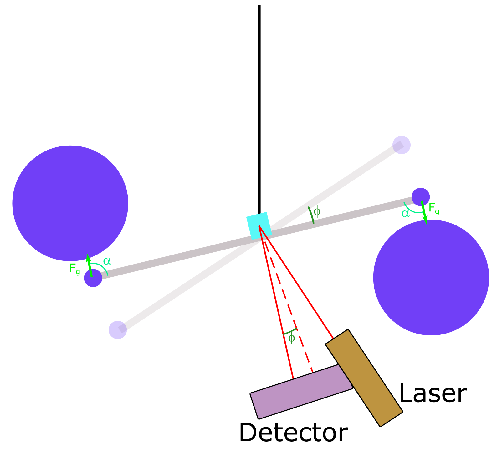

# Context for the Cavendish balance

In 1680 Isaac Newton published his law for the gravitational force  $`F_g =G \frac{m_1 m_2}{r^2}`$.
The proportionality constant was determined about a century later by Henry Cavendish in a experiment involving a torsion balance and two big masses.
The frequency of the balance yields a value for the torsional spring constant,
such that from the equilibrium position the force between the big masses and the torsion balance can be found.
Current determinations of the gravitational constant use a similar technique, where a torsion balance is influenced by big masses nearby.

# Setup 
  
    
*Schematic drawing of the setup of the experiment*

The setup of the experiment includes a barbell-like balance (grey and blue) suspended on a (tiny) string (black).
At the ends of the barbell two small masses are afixed, and near them 2 very big masses influence the torsion balance
 due to the gravitational force (light green).
The angle of the gravitational force with the barbell is given as $`\alpha`$ (blue-ish green),
 as this influences the torque the torsion balance experiences.
The balance moves out of equilibrium (partially transparent barbell) by some angle $`\phi`$ (dark green),
 which is registered by a laser-mirror-detector setup.
A laser (brown) shines onte a small mirror positioned in the the middle of the barbell (light blue),
 such that the laserlight (red) is reflected to a light detector (purple) with the same angle as the balance makes with the equilibrium position.
From the position of the light spot on the detector this angle can be calculated.


# Theory
The torsion balance experiences two torques when it is in equilibrium at an angle $`\phi_0`$,
compared to the equilibrium position without the massive balls nearby.
One is based on the gravitational force ($`\tau_g =F_g L \sin\alpha`$), the other is based on the torsion in the wire  ($`\tau_t = -D \phi`$).
Thus the equilibrium position is found as $`\phi_0 = -\frac{F_g L \sin\alpha}{D}`$
However, the balance does not start out in equilibrium and thus will oscilate around $`\phi_0`$.
The rotational equivalent of Newton's second law yields 
```math
I \frac{d^2\phi}{d t^2} = \sum\tau = -D(\phi-\phi_0) - B\frac{d\phi}{dt},
```
here $`B`$ is the damping coefficient for the torsion balance. 
Such that the solution is a damped oscilation
```math
\phi(t) = A \exp{\left(-\frac{B}{2I}t\right)}\ \sin\left(\sqrt{\omega_0^2-\left(\frac{B}{2I}\right)^2}\right) + \phi_0.
```
Where $`\omega_0 =\sqrt{D/I}`$ is the natural frequency of the balance. 

