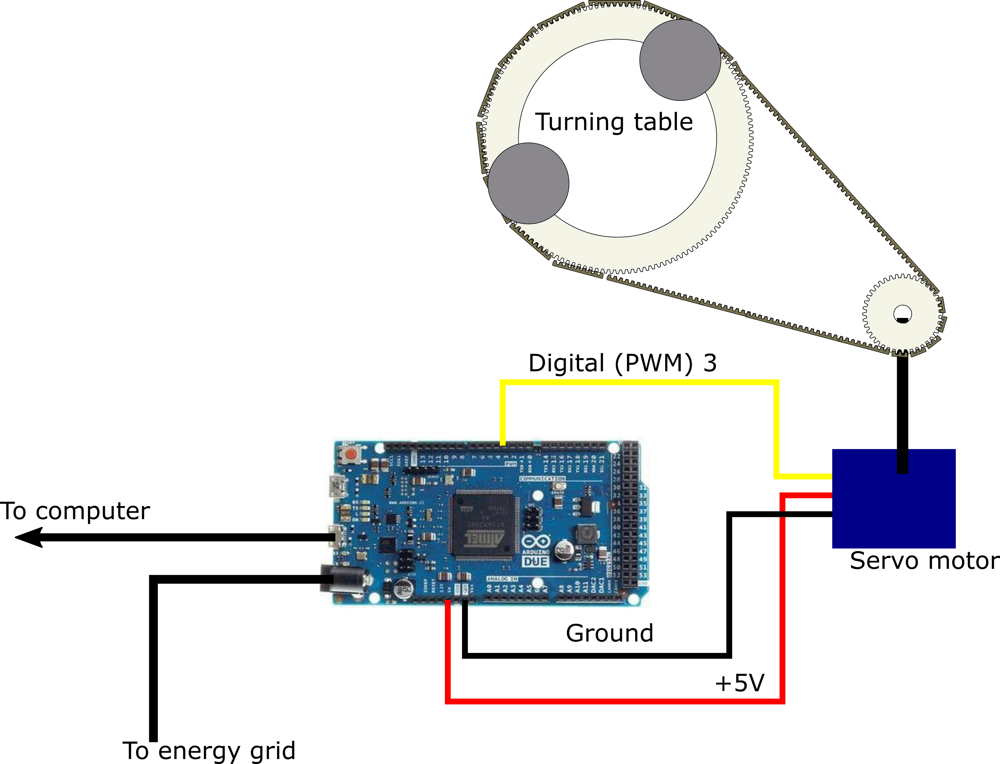
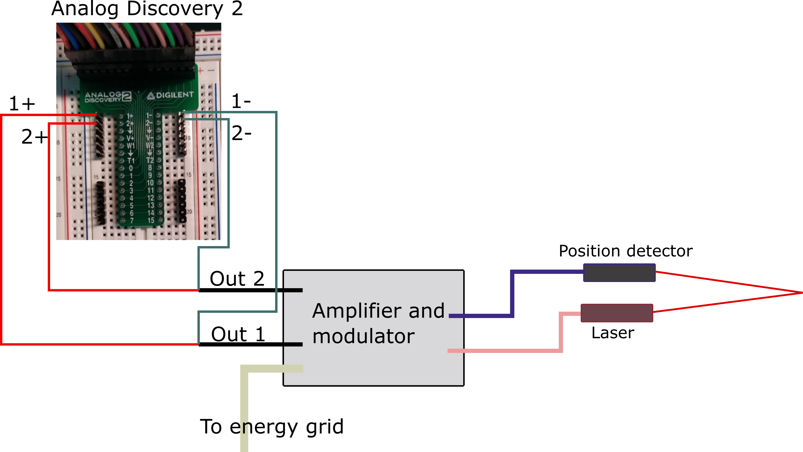

This document assumes the reader has read the [context and theory](https://git.science.uu.nl/ued2020/experiment-design-2020/-/blob/master/projects/CavendishTorsionBalance_by_Geert_and_Jillis/ContextAndTheory.md) file, and thus knows roughly the aim of the experiment and has some idea of the setup.

# Setup
The setup consists of 3 main parts; the torsion balance, the control mechanism and the detection suite.

## Torsion balance
***If it is necessary to interface with this part of the setup, please be careful.***  
During the measurement it should not be necessary to interface directly with the torsion balance. 
It is a quite delicate piece of equipment, mainly due to the wire on which the barbell is suspended.
This wire is necessarily thin and thus fragile, as a thick wire would have a too high torsion constant and thus move too little to measure effectively.   
The torsion balance consists of a baseplate, a turningtable with holders for the big balls, and the torsion balance-barbell setup.

## Control mechanism
The setup is controlled by a continuous servo attached to an Arduino Due.
The Arduino needs an external power source, as the servo needs a higher voltage than the USB can provide.
On the Arduino a program can be run to control the position of the turningtable with the big masses. 

 

## Detection suite
The detection suite comprises a laser, a lightposition detector, a modulator and amplifier and the Digilent Analog Discovery 2. 
The laser and detector are connected to the modulator to isolate the signal from other light effects which might be picked up by the detector. 
The outputs of the modulator are connected to the oscilloscope channels on the Digilent Analog Discovery 2.
To read out the signal of the oscilloscope it is necessary to download either the [Waveforms package from Digilent](https://store.digilentinc.com/waveforms-download-only/) or the package that is being written by the Software group.

 

