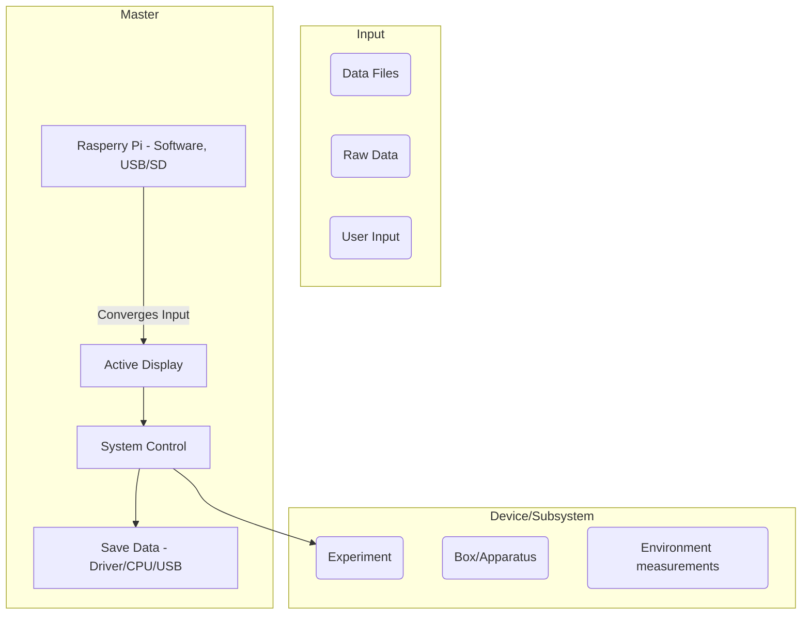

**The Subproject Collection**
________________________________________________________________________________________________________
From initial ideas, over collecting information from the cohort, to a serious plan😉. 
Put the pieces together: 

The Hardware group likes to connect all parts of the box with a "master" device if possible. 
We need certain information from all of you and and some details which may not be further specified yet.

________________________________________________________________________________________________________

**Subsystems:**
 
 **Hardware Group**
 
 *Offers to you/Uses*
 -
 *Needs from you*
 -

**Box-Design**

*Offers to you/Uses*
- Note: all measurements are made in meters. Next to that, one needs to substract some distance from both sides due to the precense of the frame of the box. The frame beams are approximately 4 cm wide.
- Top: Height: 0.90, Width 0.75
- Side: Height: 0.92, Width: 0.75, Heigth Legs: 0.25
- Side as seen from the front: Height: 0.92, Width: 0.90, Height Legs: 0.25

*Compartment size*
-Experiment compartment: Height: 55.3 cm
- Module compartment: Height: 37.2 cm
- Module box sizes are approximately 601036 cm

*Needs from you*
-

**Software Group**

*Offers to you/Uses*
- Transformation from analg/digital input to digital/analog output
- Interfacing

*Needs from you*
- An input and output possibility for the Analog Discovery 2 by Digilent (**Hardware**)
- A general overview tab (**here**?)
- 1 to 4 USB **Hardware** 
- Text base commands from adrino device **Experiment**
- Power supply for the Laptop **Power**
________________________________________________________________________________________________________

**Inputs**:

 **Power Supply**

 *Offers to you/Uses*
 - Battery with solar panel

 *Needs from you*
 - The details concerning the energy for your experimental performance/measurement
 - Operating voltage
 - Power usage
 - Is input DC or AC?
 - Additional information if possible (Stability, voltage oscillations, cold start current)
 
_ _ _ _ _ _ _ _ _ _ _ _ _ _ _ _ _ _ _ _ _ _ _ _ _ _ _ _ _ _ _ _ _ _ _ _ _ _ _ _ _ _ _ _ _ _ _
**Environment Control**

**Temperature**

*Offers to you/Uses*
- 'We will use 1 or 2 Arduino with cooling and/or heating systems and of course sensors'
- Temperature + Humidity measurments via [EmonTH](https://shop.openenergymonitor.com/emonth-temperature-humidity-node/) 
- EmonTH V2 is an open-source, :zap: wireless :zap:, **battery powered** (2 x AA from on-board holder) 
- Data is transmitted via wireless RF (433MHz) to an  [emonPi](https://shop.openenergymonitor.com/emonpi/) 
- access to WiFi or the ethernet required 

*Needs from you*
- Power supply for emonPi: 5V DC via mini-B USB socket, use USB capable of supplying at least 1.2 A. 
*'Board runs on 3.3V provided by on-board volt regulator, 
Raspberry Pi is powered by the emonPi via the GPIO pins, Raspberry Pi's 3.3V rail is not used by EmonPi'*

**Vibration**

*Offers to you/Uses*
- Gives a digital signal using the I2C-interface, which can be read by the Arduino.
- Data as USB from andrino [script](https://raspberrytips.nl/mpu-6050-gyroscoop-raspberry-pi/)

*Needs from you*
- Power supply: Module can be operated at both 3.3 and 5 V

_ _ _ _ _ _ _ _ _ _ _ _ _ _ _ _ _ _ _ _ _ _ _ _ _ _ _ _ _ _ _ _ _ _ _ _ _ _ _ _ _ _ _ _ _ _ _
**Experiments**

(...)
________________________________________________________________________________________________________________

 