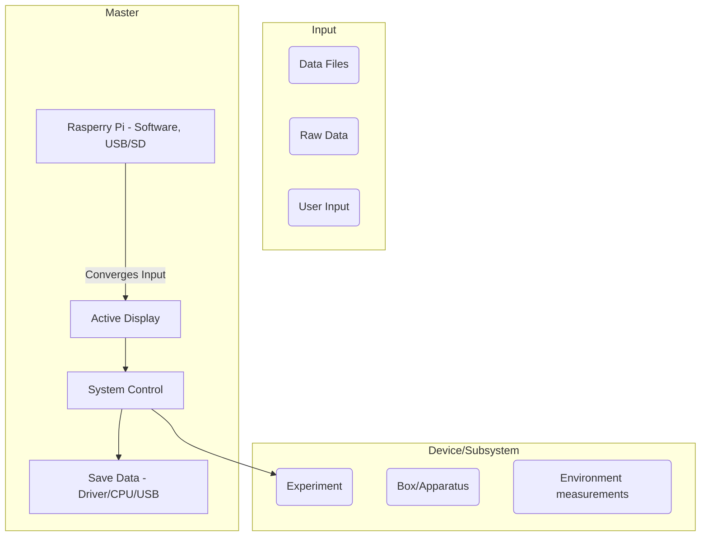

**The Subproject Collection**
________________________________________________________________________________________________________
From our ideas, over collecting information from the cohort, to a serious plan😉. 
Put the pieces together: 

The Hardware group likes to connect all parts of the box with a "master" device if possible. 
We need certain information from all of you and and some details which may not be further specified yet.

________________________________________________________________________________________________________

**General:**
 
1. Do you want all building blocks controlled and displayed via one "master" device ? 
- [ ] yes 
- [ ] no
2. Should the information from your subsystem f.e. the vibration control (still) be stored in a file ?
- [ ] yes
- [ ] no 
 
________________________________________________________________________________________________________

**Subsystems:**

*(Make your crosses and please send the answers to the questions to one of us - we will collect them and structure them as soon as possible. If you don't now the answer to one of the questions yet, skip it (for today).
Write in bullet points what you would like to display directly and/or store in a file from your experiment via the "master" device:)*

1. What kind of input can we expect from your subsystem/contribution ? 
- [ ] 
2. How would you like to connect you subsystem to the "master" device ? 
- [ ] 
3. Will your device be used to control something? 
- [ ] yes 
- [ ] no
4. Do you measure something to improve the experimental conditions? 
- [ ] yes
- [ ] no
5. Will your subsystem communicate with the others f.e. sending input to the "master"? 
- [ ] yes
- [ ] no
6. Do you perform an experiment/measurement which produces data in a file ? 
- [ ] yes
- [ ] no
7. What file format ?
- [ ] 
8. How/where will your data be stored ? (SD, USB, InternalPC) 
- [ ] 
9. Will it be raw data (changes in current, ...)?
- [ ] 
10. How will you send/transfer the raw data ? 
- [ ] 
11. Anything else that we may not think about yet ? 
- [ ]