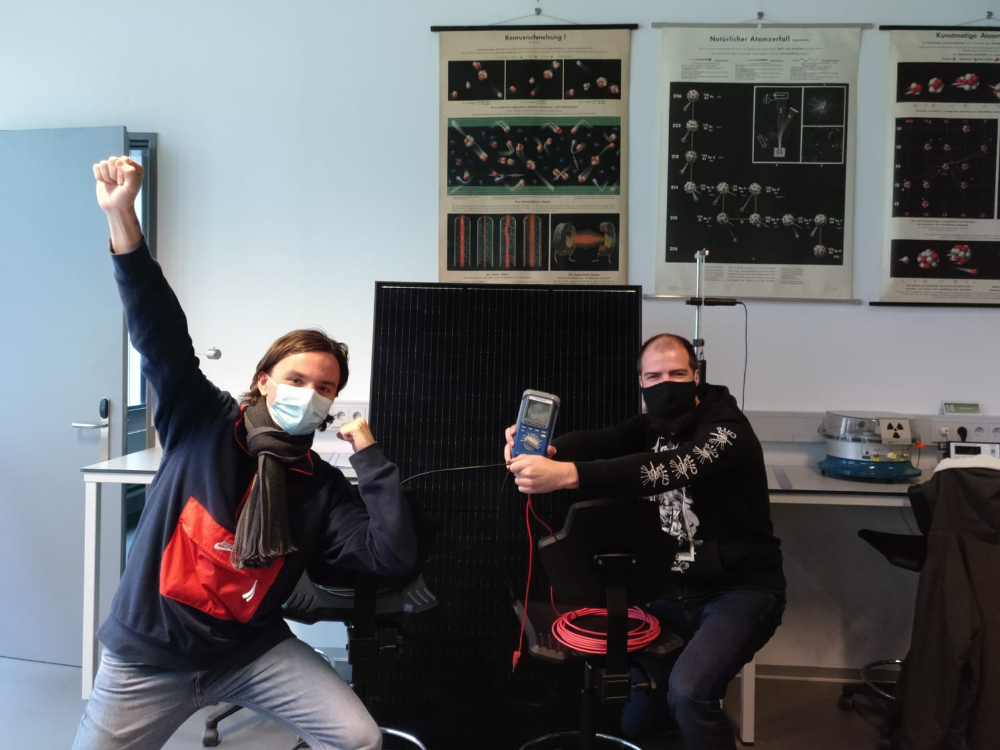

# List of files you may be looking for (if not, ignore this section)
- [Report context and theory](./documentation/report_context_theory.md)
- [Project goals](./documentation/project_foals.md)
- [Personal goals Maurice](./documentation/Personal_Goals_Maurice.md)
- [Personal goals Jakob](./documentation/personal_goals_jakob.md)

# Power supply for Experiment box

In this subproject considerations and the design of a power supply that suffices for the needs required are made.
The goals of this project are briefly elaborated on the [canvas](./documentation/project_canvas_ps.pptx).

A comparison between different levels of DIY can be found [here](./documentation/Comparison_powerbank_DIY.md).
Where the major difference is the level of knowledge regarding electronics required to build it.

A current list of parts for this project can be found [here](./documentation/list_of_components.md).
The current plan consist of a powerbank (5V), 12V lead acid and inverter to provide all the needs specified.
A load-switch and monitoring system will provide the safety and communication with other parts of the box.
It is further expanded with a solar panel to charge the station remotely.

### Our first milestone
