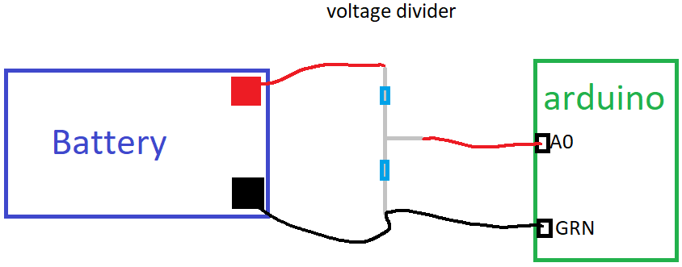

## Instructions to use the arduino to measure battery voltage

From the battery voltage one can infer its charge status (see [datasheet](https://asset.conrad.com/media10/add/160267/c1/-/en/000250916DS01/datablad-250916-conrad-energy-12-v-12-ah-loodaccu-12-v-12-ah-loodvlies-agm-b-x-h-x-d-151-x-95-x-98-mm-kabelschoen-635-mm-onderhouds.pdf)).
A too high or to low voltage is undesired for battery health and safety reasons, so it should be monitored.
Digital monitoring with the Arduino is possible but its analog pins have a lower maximal input voltage than the battery.
That is why it has to be downconverted using a [voltage divider](https://learn.sparkfun.com/tutorials/voltage-dividers/all). 
This can then be connected to the arduino and be read out to the user.

1. download the arduino IDE from their [website](https://www.arduino.cc/).
2. Under Tools > Boards > Board manager, download the correct package for the arduino you are using.
3. Download the [arduino code ](./VoltageMeter.ino)and change the factor of 3.3 to the maximum voltage the model you are using can measure. (3.3 is for Due, for most others its 5.0)
4. Connect the voltage divider to the battery and the arduino as in the picture below. The tape on the voltage divider indicates to which pole it must be connected on the battery (red to red, black to black).

5. Verify the script and upload it to the arduino to run the code.
6. Open the serial window to read the results.