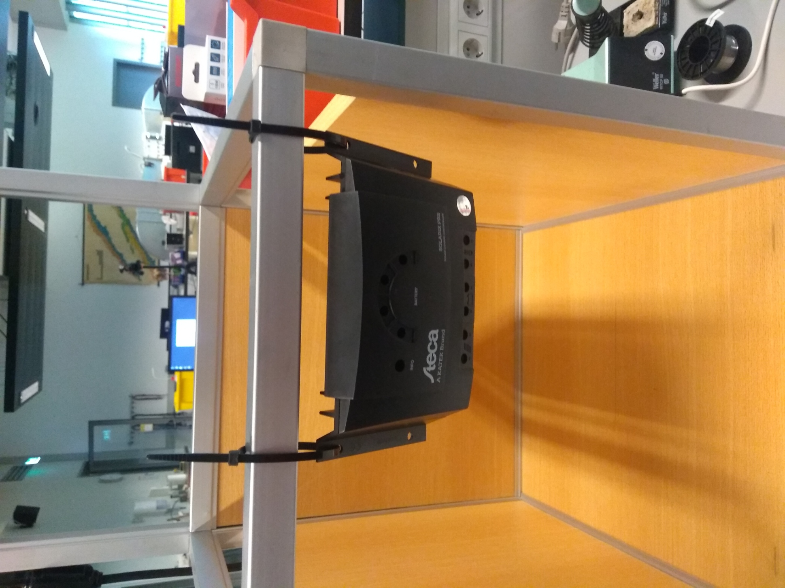

# Instructions

## purpose and theory

## safety recommendations

## assembly + test measurements

### Step 1: Set up Charge controller
1. Put the Charge controller (CC) in an upright position (see picture)

2. Connect the battery to the CC by first connecting the red cable (containing a fuse) to the positive pole of the CC, then the black to the negative.
3. In the same order, connect the solar panel to the CC.
Use the solar cable with MC4 connectors attached to one side.
Those determine where to attach it at the panel.

**Measurement** \
Measure the voltage between the poles of the battery the battery using a multimeter over at least 10 minutes. \
Check if it is increasing in the range 12.0-13.8 V.
This means it is charging.
Compare that with the charging curve in the battery [datasheet](https://asset.conrad.com/media10/add/160267/c1/-/en/000250916DS01/datablad-250916-conrad-energy-12-v-12-ah-loodaccu-12-v-12-ah-loodvlies-agm-b-x-h-x-d-151-x-95-x-98-mm-kabelschoen-635-mm-onderhouds.pdf) 
Measure the open-circuit voltage of the solar panel.
For that, temporarily disattach the cables from the CC and connect them with the multimeter.

### Step 2: Connect loads
In the setup there are two loads, the inverter and DC/DC converter.
Those have to be connected to the same poles of the CC.
1. Twist the cable ends with matching colours together
2. Connect them to the CC, positive pole first.
3. Connect the open end of the modified USB cable to the output poles of the converter.
4. Connect the power bank. 

**Measurement** \
Interconnect the multimeter between converter and powerbank to measure the current. \
Check the specifications of powerbank and converter regarding maximum input/output current. \
Measure the current on the input poles of the converter with no load attached. 
This is the stand-by current of the DC/DC converter.

## Results

| Quantitiy | Result |
| --- | --- |
| battery voltage |  - |
| solar panel open-circuit voltage| - | 
| powerbank current | (1.01 +- 0.01) A |
| stand-by current DC/DC | (0.05 +- 0.01) A |
| R1 | 19.9 kOhm |
| R2 | 4.7 kOhm |

## outlook (what can be improved)
- switches
