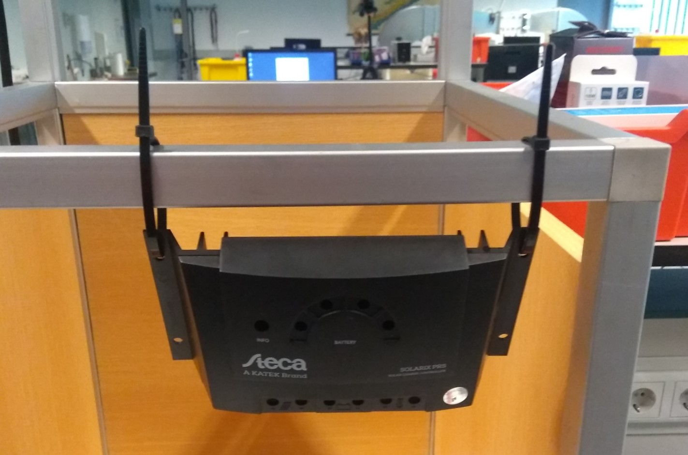

# Instructions

## purpose and theory
### Goal of the project

The goal of the power supply project is to construct a circuit that supplies stable power to all electronic devices (loads) of the science station in an off-grid fashion.
For that we chose power generation by solar panels, which makes us independet of wall outlets.
As the power coming from the panels is dependent on lighting, we need to interconnect a power storage that can supply stable power when charged up.
The loads of the science station can in principle run on DC or AC current and at different voltages. This affects the choice of batteries and additional components we need as described below.

### A comparison of different strategies

In the scope of electronics, there are a thousand different ways to construct what you want, with additional options left and right.
We narrowed it down to three different categories.
The two extremes are ready-made solutions and a full DIY plan of building the setup.
In between is the use ready-made parts that fullfill certain sub-tasks with some hand-made solutions and connections.
Here I will go over the general advantages and disadvantages of each and why we made certain choices.
A full list with examples of parts can be found [here](Comparison_powerbank_DIY.md).

Ready-made solutions are easily available for small scale projects.
Think of powerbanks with a solar panel attached that can be put on a backpack.
These are intended to charge a phone or laptop while on a hike for instance.
The major advantage is that its a very simple solution, it provides a 5V USB output that is used by many small-scale devices and some of the more advanced powerbanks ever have 230V AC output.
A disadvantage is that they are not modular at all, you get what you buy with very limited or no options to modify to your needs.
In order to get more options, very expesive systems are required and even then are limited to 50W output power most of the time.
The solar panels on these setups are very small and cause the time to charge the powerbank to increase to inconvenient amounts.

A full DIY would consist of the hand-made construction of each of the electronic component, made from basic parts like resistors, capacitors, transistors and opamps.
The obvious advantage is the full control of the setup is gives.
Any voltage or current can be obtained by tuning the elements to your liking and expanding the setup in the future usually has no limitations.
On first thought, the goal of this projects does not sounds all that complicated.
However, batteries require more than just a voltage to charge themselves.
A lead-acid battery, for instance, has [3 stages](https://batteryuniversity.com/learn/article/charging_the_lead_acid_battery), a constant current, a constant voltage and a topping stage.
To regulate this, a complicated feedback loop and voltage/current generation circuit is required.
This must include properties of the battery used hardwired into the circuit.
Other [DC/DC and DC/AC converters](https://learn.libre.solar/development/dcdc_converter.html#linear-regulators) are relatively simple in concept, but may require specials parts that can operate at higher power outputs that are not easily obtained.
Safety and the shielding of these components requires a  lot of practical knowledge of electronics.
Hence, all-in-all such a setup is very versatile, cheap and modular. But on the other end, it requires up to 100 hand-picked parts tuned to exactly the right values which need to be calculated first.

A third option is the use of some ready-made parts for complicated task, combined with hand-made parts where possible.
This solution attempts to find a middle ground between the required knowledge, expertise and the cost of the setup, while still obtaining the option for all reasonable output voltages and power supplies.
An example is a solar charge controller, which consist of a DC/DC converter that turns the voltage from a solar panel into the correct one for charging a lead-acid battery.
Additionally, this provides the charging scheme for such a battery, with deep-discharge and overcharge protection.
The output would be the regular voltage of the battery in question.
This voltage (approximately 12V) can be used directly for scientific devices and downconverted to another standard, the 5V for small USB devices.
A powerbank can be used as intermediate 5V power storage for more convenient use.
An inverter can be used to obtain 230V AC power, which devices that are meant for indoor use need.
Overall, this results in the modularity that is comparable to a full DIY setup, but is still constructable in an afternoon given the parts and some tools.
The power output can reach high values that are not obtainable from ready-made solutions.
Regarding the cost, it is considerably lower than a ready-made solution with similar properties.
With spending some extra time on looking up the right parts, it is usually a bit more than individual basic parts, but it is not uncommon to find mass-produced devices that are very cheap in comparison. Hence, we chose the latter option with how we want to build our project.

### Project outline

The central unit of this setup will be the batteries that store and supply the science station.
In order to supply voltages that are widely used, a 12V lead-acid battery and a 5V litium-ion USB-powerbank are combined.
The 5V USB connection are the most convenient and widely used for small electronics like arduinos, which are the main controllers for the science stations.
Some other devices might need a higher voltage or even an alternating current.
This is easier to achieve with a 12V lead-acid battery, as it can suffice a higher output power.

The next step is a way to charge both the batteries independently off the grid.
A solar panel can supply power anywhere it is, even some at cloudy days.
Each battery has its own pattern of charging.
Luckily, 12V lead-acid batteries are commonly combined with solar panels as off-grid or self-sustaining setups.
Therefore a solar charge controller is an easy tool to convert the variable output voltage of the solar panel into a useful one for the battery.
It also has deep-discharge and overcharging protection features, which come in handy. 
This charge controller provides a connection for the loads as well, as a 12V DC output.

With a DC/DC converter, this is converted into a 5V supply, that can charge the Lithium-ion battery as well.
A lead-acid battery is also used in cars and we used a tool for cars that can convert it to 230V AC power as additional power supply for devices that need regular wall-socket power.

To communicate with the rest of the science station, a connection with an arduino can be made.
This monitors the capacitance of the batteries and can shut down the experiment when the batteries are running out of power.
A load switch can disconnect the load, to avoid deep-discharging the batteries.
In our case, both the Charge Controller and the powerbank have internal load-switches that take care of this already.
However, additional protection and control can be obtained by adding these.

Below, A schemetic can be found of the setup.

### Important considerations

The lead battery has to be charged with a voltage close to its nominal voltage of 12V. 
Also it is sensitive to overcharging or deep discharge. 
This is taken care of by the charge controller, which also internally downconverts the input voltage from the solar panel.

As the charge controller will shut everything down in case of too high or low battery voltage and that can be troubling for some components there is a need for additional voltage monitoring.
This enables the user to disconnect the loads in time.

As described above, the lead battery is the most sensitive component of the setup.
It is needed because of AC loads in the science station.
The current from the solar pannel is DC and most loads use 5V DC which can be supplied via USB, which makes a power bank the convenient option.
However, an inverter that makes AC current out of DC input cannot connect to a power bank so the 12V lead battery is needed.

### Possible sources of noise

Not a source of noise but a nuisance is the weather dependent power supply of the solar panel
Other things: inverter uses standby power, the voltage measurement for the load switch is kind of inaccurate because of use of a high-resistance voltage divider.
Each of the DC sources will have a few percent variance. However, this is not an issue, since the tolerance of the devices used is fairly large.

## safety recommendations

Do not ever short circuit the 12V lead-acid battery, it will explode!

In order to safeguard yourself and the setup, be very careful with where you leave the cables laying around.

Only remove the safety caps from the poles of the battery when attaching the cable.
Still be careful where the other end of the cable is.
immediately put the safety caps back on once you remove the cable. 

## assembly + test measurements

### Step 1: Set up Charge controller
1. Put the Charge controller (CC) in an upright position (see picture)

2. Connect the battery to the CC by first connecting the red cable (containing a fuse) to the positive pole of the CC, then the black to the negative.
Images on the CC indicate which 2 connections are for the battery (eg. the the in the middle).
3. In the same order, connect the solar panel to the CC.
Use the solar cable with MC4 connectors attached to one side.
Those determine where to attach it at the panel.

**Measurement** \
Measure the voltage between the poles of the battery the battery using a multimeter over at least 10 minutes. \
Check if it is increasing in the range 12.0-13.8 V.
This means it is charging.
Compare that with the charging curve in the battery [datasheet](https://asset.conrad.com/media10/add/160267/c1/-/en/000250916DS01/datablad-250916-conrad-energy-12-v-12-ah-loodaccu-12-v-12-ah-loodvlies-agm-b-x-h-x-d-151-x-95-x-98-mm-kabelschoen-635-mm-onderhouds.pdf) 
Measure the open-circuit voltage of the solar panel.
For that, temporarily disattach the cables from the CC and connect them with the multimeter.

### Step 2: Connect loads
In the setup there are two loads, the inverter and DC/DC converter.
Those have to be connected to the same poles of the CC.
1. Twist the cable ends with matching colours together
2. Connect them to the CC, positive pole first.
3. Connect the open end of the modified USB cable to the output poles of the converter.
4. Connect the power bank. 

**Measurement** \
Interconnect the multimeter between converter and powerbank to measure the current. \
Check the specifications of powerbank and converter regarding maximum input/output current. \
Measure the current on the input poles of the converter with no load attached. 
This is the stand-by current of the DC/DC converter.

### Optional Step 3: using the arduino to measure the battery voltage
Specific instructions on how to use the arduino can be found [here](./Arduino/Arduino_Instructions.md).
This is still a work in progress and does not provide much use for now.
Therefore, there are no nice connection at the moment.
However, banana plugs and alligator clips can suffice.
The goal is to use this to keep an eye on the battery capacity and send a message to the rest of the seup once the battery runs low.

## Results

| Quantitiy | Result |
| --- | --- |
| battery voltage |  12.0-13.8 V |
| solar panel open-circuit voltage| depends on irradiation | 
| powerbank current | (1.01 +- 0.01) A |
| stand-by current DC/DC | (0.05 +- 0.01) A |
| R1 | 19.9 kOhm |
| R2 | 4.7 kOhm |

## outlook (what can be improved)

The voltage measurement using the Arduino can be expanded.
By choosing a minimal and maximal voltage value informed by the discharge characteristic of the [datasheet](https://asset.conrad.com/media10/add/160267/c1/-/en/000250916DS01/datablad-250916-conrad-energy-12-v-12-ah-loodaccu-12-v-12-ah-loodvlies-agm-b-x-h-x-d-151-x-95-x-98-mm-kabelschoen-635-mm-onderhouds.pdf) one can infer wether the battery is over– or discharged or malfunctioning in another manner.
This can then either be displayed in the science station software GUI and dealt with by the user by manually switching off the loads or an automatic load switch can be implemented.
Swtiches in general would improve the flexibility of the power supply.
They would enable (dis–)connecting any desired device in the circuit without the need of (un)screwing connections.
This would greatly improve overall usage of the system within the science station.
