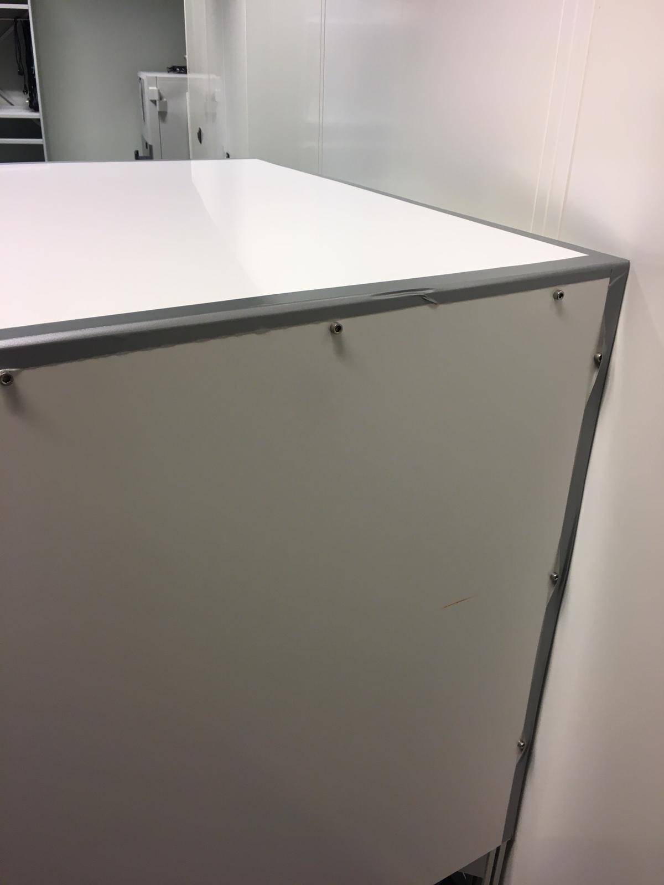
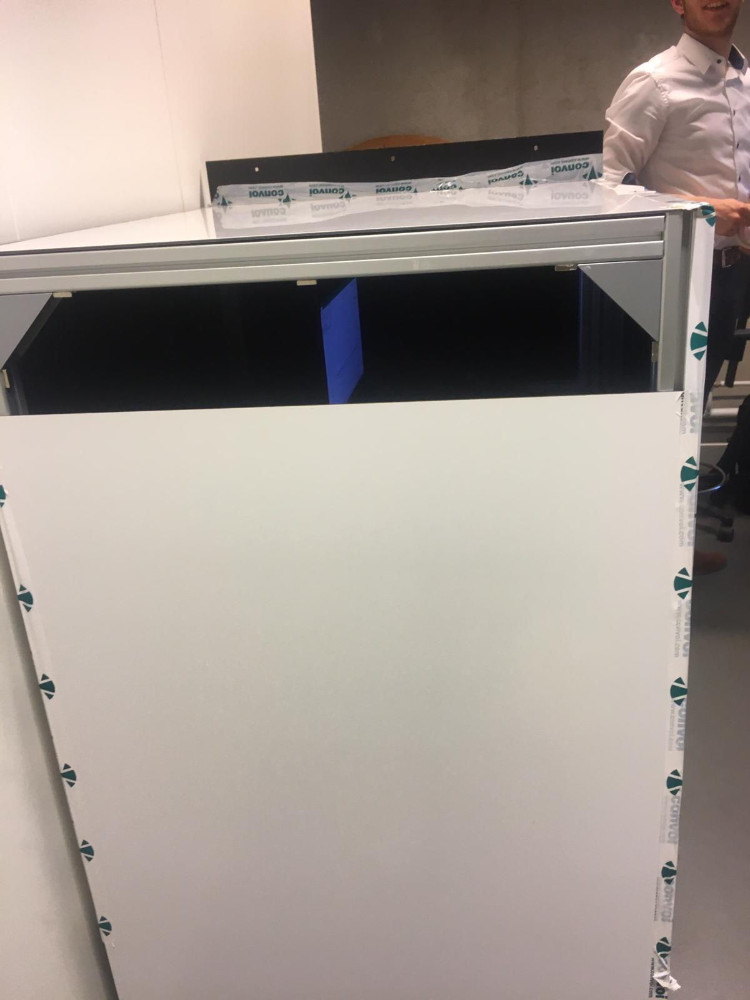
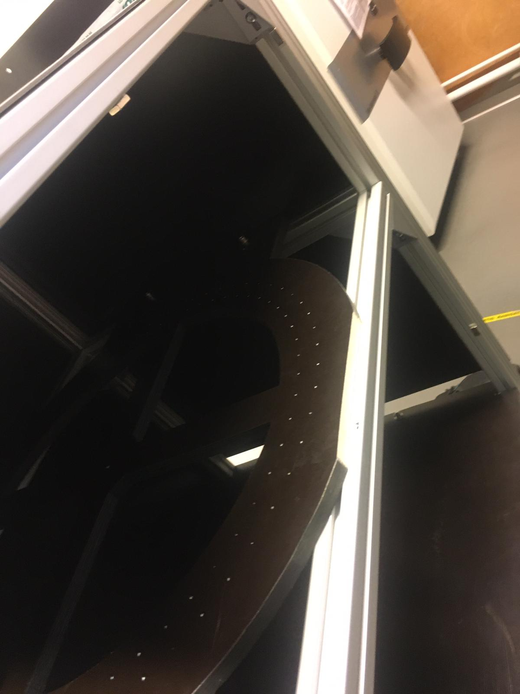

# Temperature measurement

In this section we discuss a small, quantitative experiment we have done in order to test whether one of our plans for The Box™ will work once the total module is operational. We have ran an experiment that will be explained below, and we will discuss the results, and draw conclusions whether something must change in our desing.

## Aim of the experiment

The experiment we chose to carry out is one that will test whether The Box™ needs additional (active) ventilation. We expect that especially the modules and power supply components will generate quite some heat, and we are worried that the heat cannot escape The Box™. By carrying out two measurement-sets (one with The Box™ completely closed and taped off with dukttape to make it waterproof, and one with two panels opposite to each other slightly shifted down, so that airflow is possible (passive ventilation)). In both measurement-sets, the temperature will be monitored and plotted afterwards.

## Experiment setup

The setup consisted of:
- The Box™;
- Two glass beakers;
- The Arduino-temperature setup from the Temperature Controle Group;
- Dukttape;
- A laptop supporting the Arduino software.

The first measurement has The Box™ completely sealed off. First, all sides but one are taped off and thus made waterproof. Water is cooked, and put in the two beakers. The beakers are then placed in the box, in the lower compartment (because this one has the steadiest flooring, and we don't want water pouring over the laptop and/or Arduino). Once the initial steam cloud is gone, the laptop and the temperature sensor are placed inside, and the last panel is sealed off. The sensor writes to the Arduino IDE every ten seconds. After 20 minutes of measurement, the box is opened again, data is retrieved and put in Excel.

The second measurement has two opposite panels of The Box™ slightly ajar, and thus has a passive ventilation channel. Apart from that, the experiments are the same.

## Results

## Discussion and conclusion