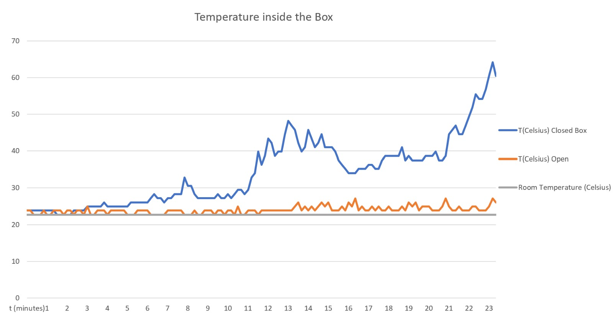

# Temperature measurement

In this section we discuss a small, quantitative experiment we have done in order to test whether one of our plans for The Box™ will work once the total module is operational. We have ran an experiment that will be explained below, and we will discuss the results, and draw conclusions whether something must change in our desing.

## Aim of the experiment

The experiment we chose to carry out is one that will test whether The Box™ needs additional (active) ventilation. We expect that especially the modules and power supply components will generate quite some heat, and we are worried that the heat cannot escape The Box™. By carrying out two measurement-sets (one with The Box™ completely closed and taped off with dukttape to make it waterproof, and one with two panels opposite to each other slightly shifted down, so that airflow is possible (passive ventilation)). In both measurement-sets, the temperature will be monitored and plotted afterwards.

## Experiment setup

The setup consisted of:
- The Box™;
- Two glass beakers;
- The Arduino-temperature setup from the Temperature Controle Group;
- Dukttape;
- A laptop supporting the Arduino software.

The first measurement has The Box™ completely sealed off. First, all sides but one are taped off and thus made waterproof. Water is cooked, and put in the two beakers. The beakers are then placed in the box, in the lower compartment (because this one has the steadiest flooring, and we don't want water pouring over the laptop and/or Arduino). Once the initial steam cloud is gone, the laptop and the temperature sensor are placed inside, and the last panel is sealed off. The sensor writes to the Arduino IDE every ten seconds. After 20 minutes of measurement, the box is opened again, data is retrieved and put in Excel.

The second measurement has two opposite panels of The Box™ slightly ajar, and thus has a passive ventilation channel. Apart from that, the experiments are the same.

Below, a few images can be seen. The first one shows the completely sealed off Box™, the second one shows the passive ventilation setup, and the third one shows the insides of The Box™.

## Safety Measurements

There are a few safety measurements for this experiment. Things to watch out for:

- The edges of The Box™ are sharp, do not cut yourself when adding or removing the panels;
- The Box™ is quite heavy. Do not let it run over your feet, for example;
- You are working with boiling water. Do not burn yourself.

## Results

The measurement ran for 20 minutes, with every 10 second a measurement point. We have made a plot of the two data sets:

## Discussion and conclusion

As you can see, we were indeed correct with our hypothesis: the temperature in the sealed off Box™ keeps rising, whereas the temperature in the passively ventilated Box™ stays at a somewhat constant line. We do therefor need some kind of ventilation in The Box™. The bump in the sealed off Box™ cannot be explained by us. We think it comes from fluctuations in the temperature sensor, or maybe some water damped down on the sensor itself. Apart from that, we think the measurement also contains some uncertainties due to the fact that the sensor was at the top compartment, and heat rises. 