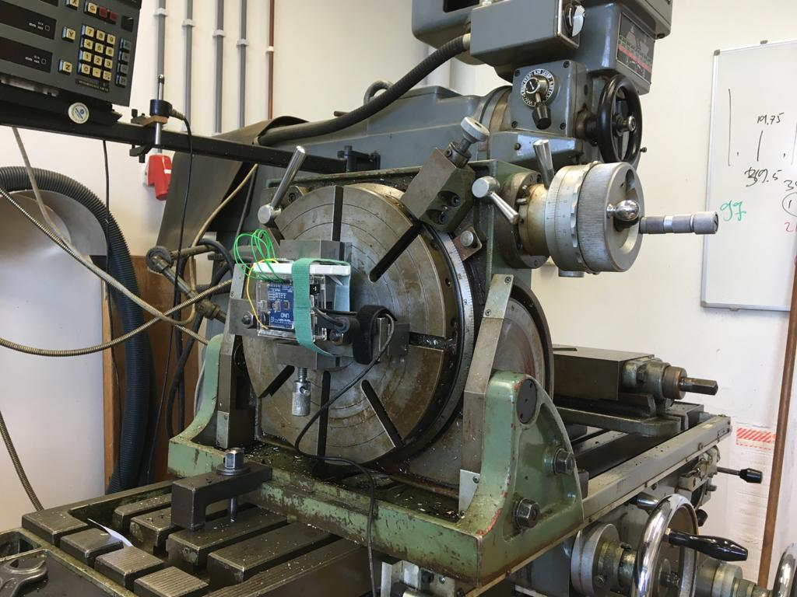
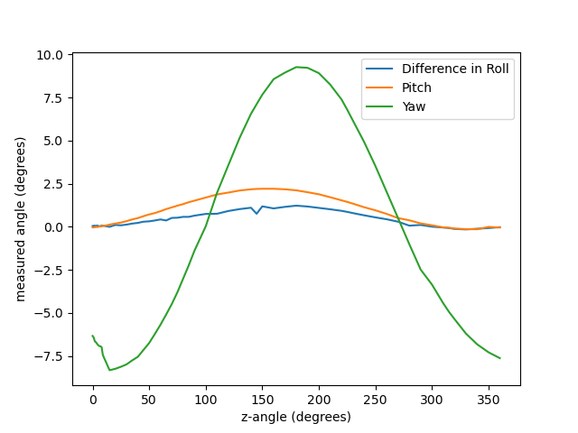
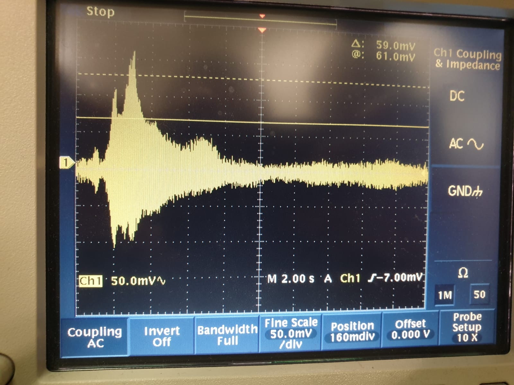

The goal of our group is to provide a stable platform for the measurement setups. This goal was split up in 2 sub goals: Measurement of the level and oscillations and designing a level platform to isolate these oscillations. 
Looking into the methods used to measure the oscillations and level, an accelerometer was found to be easiest to use. The first accelerometer used was a MPU6050 GY521, a sensor designed to be read out using an arduino. This sensor has a wide array of pre-written libraries online which makes using the sensor quite easy. 
The data gained from the sensor is dependant on the chosen library, the main differences here lay in the readout of the acceleration on x,y,z yaw, pitch, roll or the position in yaw, pitch and roll. Furthermore the sensor is able to measure temperature but this option was not used for this project. The sensor was first used in a measurement to check the accuracy of the yaw pitch roll position of the sensor. This was done by placing the sensor on a division table on a mill. Using this table the sensor can be turned accurately within 0.016 degrees. A photo of the setup can be seen here 

The sensor was put as square to the table as possible but the measured signal proves this wasn’t completely true. The plots below show the measured yaw, pitch roll as a function of the set angle by the division table. Here the table is turned in the pitch direction. To display the roll accuracy in more detail the measured angle is subtracted from the set angle. 

As can be seen in the yaw and roll plots, the division table was not completely square to the mill table. When the setup was completely square the line should be all 0. However when looking at the pitch plot, it can be seen that the more the yaw and roll differ from 0, the more the pitch differs from the set angle. In theory the measured angles should be accurate up to 0.01 degree. This is however difficult to prove using the measurements done. Looking at the difference plot one conclusion can be that the angle can be measured within a 1.3 degree accuracy. However, because the yaw and roll there is a good argument that the accuracy is higher than the 1.3 degrees. However it is beyond the scope of the project to determine the effective accuracy.

In our second experiment, we wanted to see if we would actually be able to see vibrations with our accelerometer, as well as how simple spring/damper-systems would react to these vibrations. To do this, we clamped our bass-shaker to a board, which we connected to a function generator (10.8 Volt, 1 Ampére). To prepare the simplest system, we put the board on top of a damper (foam), but our accelerometer on a mass (8 Kilo) and put that mass onto the board. We than connected our accelerometer to an oscilloscoop. When we have our bass-shaker vibrate at a certain frequentie, we thus find a certain amount of amplitude that the accelerometer is moved by. If this is done for a lot of different frequenties, this will give us a picture like shown below.

In the "[RawSignals](https://git.science.uu.nl/s.helsloot/experiment-design-2020/-/tree/master/projects/Stabilization_by_Mark_and_Stijn/TestRuns/AccelerationTest/RawSignals)"

In conclusion it can be said that the goal of the project was a bit too ambitious. The level of the platform can measured with an accelerometer but to properly calibrate this sensor a more accurate setup than used is needed. It was determined that in the least accurate case, the angle can be measured with an uncertainty of 1.3 degrees. However this is most likely an overstatement which has to be narrowed down in future research. When looking at the accelerometer measurements with respect to the vibrations, it can be concluded that making an accurate measurement surrounding the vibrations present in a system is fairly difficult. However when looking into the data, it can be advised to use a setup with simple springs to isolate vibrations. Other dampers might prove effective in decreasing the transfer function even further, but these setups will become more complex rapidly.