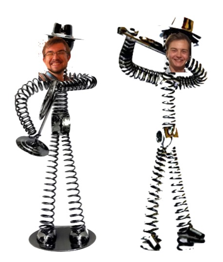

In this ReadMe-file, we will place the manual for our folders, as well as our experiments. 

The purpose of our experiment was to be able to both see/filter out vibrations, as well as get/keep the experiment level (see our [canvas](project_canvas_-_Stijn_Mark.pptx)).

First off, before you start, we would advice you to get a cup of coffee. You got that? Good, time for the experiments then. 

**Leveling:**
We firstly thought that, in order to get the experiment level, we could use to yaw, pitch and roll (which is something the acceleromotor is able to measure). In the end, you'll find that there is a big problem with trying to do it this way, which is that it resets everytime you restart the acceleromotor. However, it's a good experiment to do, because you will find that this part of the acceleromotor is very precize. 

To do the yaw pitch roll measurments, only the arduino uno, MPU6050 and connectors are needed (in principle). With these components, the MPU6050 can be read out and that's all that’s needed (see ["List_Materials and Code_Used"](Measurements/List_Materials_and_Code_Used.md) for the arduino code that we used, along with our file that explains [how to use the arduino and MPU6050](Measurements/How_to_use_the_Arduino.md)). To do the calibration, a platform that can be rotated is needed. We used a machinist’s division table for this, but other platforms can be used. The machinist table is place in the upright position so (under the assumption that everything is straight) the z-axis of the chip is parallel to the gravitational vector. (again under the assumption we live on a flat earth with homogeneous gravity) When turning on the arduino it self calibrates to gravity so from that point everything is relative to that point. (this implies that for a reproducible result, the sensor needs to be booted in the exact same position)

When the sensor is setup and measuring the table can be rotated around the clock. This is done on increments of 1 degree from 0 < theta  < 10, than 5 degree intervals up to 90 degrees and from this point on only every 10 degrees to complete the circle. Whilst setting the angles it has to be taken in account that there is some mechanical give in the system. This could introduce a new error in the system when not dealt with correctly. To compensate for this give, the knob has to be put onder strain on the same side of each measurement point. This means either at the beginning or end of the give.  On each of the set angle points the yaw pitch and roll have to be manually read out. When all data is collected the points can be plotted in a program of your own choosing.

The Full Setup that we used can be found in the ["SetUp1"-folder](Measurements/Yaw_Pitch_and_Role_Measurements/SetUp).

The rest of the data and graphs that we gained, can be found in the ["YawPitchRole"-folder](Measurements/Yaw_Pitch_and_Role_Measurements).

**Vibrations:**
The main experiment that the "experiment-group" wanted to do, was the Cavendish-Experiment. This means that frequenties below 10 Hz will be "deadly" to the experiment. Our main objective thus became a little more specific than what we started with. However, we weren't able to find a good way to "create" these low frequenties (since low frequenties posses low energy), thus we also weren't able to measure them and thus see if our system could filter them out. Because of this, we have only taken a look at frequenties between 20 and 100 Hz, because those we could create and see. 

In a vibration experiment, one needs 3 things:
- Something that creates the vibrations
- A mass that vibrates, on which you can stick your measuring device
- A device on which you can see the data measured.

In our case, that something that creates vibrations became a bass-speaker. However, if one can't get a viable machine that gives off a constant frequency, you can also use one single strong wave(for example made by the hit of a hamer on the work-surface). Our bass-speaker had been secured to a woaden board, which we put on some form of dampening substance. The main reason that we started to use such a dampening substance, was because otherwise, the board would vibrate off the table. However, by doing this, we "accidentally" created a double-spring system, which is better at filtering out frequencies. 
On the other end of the board, we can then put our mass with our measuring device (the acceleromotor). Between the board and the mass, we can then prepare our system (this can be springs, a dampening substance, or in the easiest case: nothing). To see what has been measured, one has to take a look at what kind of acceleromotor one has. For our experiment, we used an acceleromotor that could directly be plugged into an oscilloscope, meaning that we could visualize the waves on there. In some cases, one can also plug the oscilloscope into the computer, and thus you can easily extract the data. In our case, we could only get possesion of a older type of oscilloscope, which wasn't able to do this (unless we would have found a floppy-disc and a way to get this floppy-disc into our computer).
However, one can also use the computer and the waveforms-programme of digilent, which is also able to visualize waves. The only thing that's left now, is to show how the system that you have taken a look at reacts to a certain frequency. This is done by making a bode plot, which can be done by a very good oscilloscope, but you can also do it by hand (which takes a lot longer).

If neither of these 2 is possible, one doesn't have to build our entire setup, in order to still be able to see that the accelerometer can measure waves. One can also "visualize" the waves by just directly looking at the acceleration-output that you get when running the arduino-file "MPU6050_DMP6" (see our arduino-explanation file how to find this). To do this, all you need is the arduino, the accelerometer and a work-surface. When looking at the raw data, you should see that the acceleration changes when you hit this work surface. 

The Full Setup that we used can be found in the ["SetUp2"-folder](Measurements/Acceleration_Measurements/SetUp). We als made a ["Materials and Code_Used"-file](Measurements/List_Materials_and_Code_Used.md) where you can find all the materials and code that we used for our setup.

The rest of the data and graphs that we gained, can be found in the ["RawSignals"-folder](Measurements/Acceleration_Measurements/RawSignals) and the ["FFT"-folder](Measurements/Acceleration_Measurements/FFT). As said before, we only have pictures of our data, since we weren't able to get an oscilloscope from which we could actually extract our full data. Because of this, there is also this added error-bar in our graphs. 

If you want to see more about what we did with our setup, see our [First Rapport](Rapport_after_first_weeks.md).

**Hazards:**
- If the people after us decide to also use a machinist’s division table (on the mill), keep in mind that you are working with heavy machinery. So first off, don't consume any alcohol while operating this machines, but also make sure the machine is turned off when you are changing the settings manually.
- Don't shake/drop the acceleromotor to much (nor the arduino), since this is fine equipment. 
- If you use a bass-shaker, keep in mind that it can vibrate off the worksurface, as well as overheat. 

**Needed Contact Information:**

Stijn Helsloot, s.helsloot@students.uu.nl

Mark Waterlaat, m.m.a.waterlaat@uu.nl

Dante Killian, d.killian@uu.nl (Contact person for equipment)

Rene Barthel, (Contact person for equipment)
